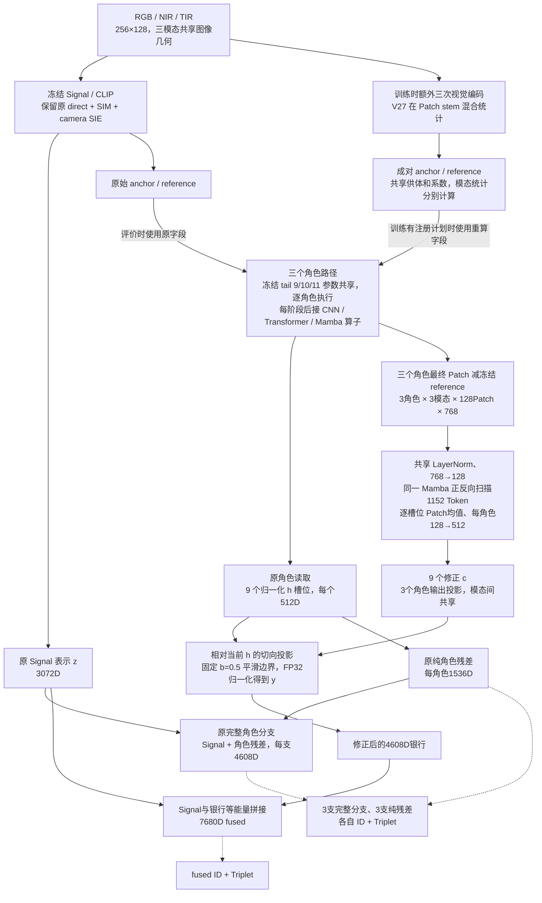

# V29 当前网络、监督位置与能力边界

适用于固定执行代码 **f4c6a03e1b263aaa9e4bce71427152007018a0ca** 的 RGBNT201 V29。本文描述实际代码；检索效果以完整六端终态为准。网络并非稀疏MoE，三种角色都执行。

## 完整前向关系

图中训练的额外视觉编码在注册计划不激活时仍运行，并核对重算字段与原字段精确一致；p=0.5控制统计混合是否实际作用，不是决定是否执行额外pass。评价时不做统计混合，也不做额外重编码。完整Signal路径不接收这项特征统计扰动，但仍接收该batch原有的图像增强。

所有CLIP参数和reference都冻结；尾部参数共享不等于只执行一次。三个角色有不同中间特征，共享tail分别处理各自路径；冻结tail仍传递对角色输入的梯度。联合模块读取的是池化前Patch残差，独立角色输出另走各自读取路径。

## 原角色与联合头读的不是同一种摘要

| 角色 | 角色算子 | 独立身份槽位h的读取 | 联合头的输入 |
| --- | --- | --- | --- |
| CNN | 语义网格高频残差、局部/膨胀卷积 | Patch差分经四个水平分区、投影到512D | 完整128个Patch差分 |
| Transformer | CLS与Patch全局自注意力 | CLS差分经投影到512D | 完整128个Patch差分，去掉CLS |
| Mamba | 模态内四方向空间扫描、同位置三模态双向混合 | Patch差分均值经投影到512D | 完整128个Patch差分 |

四水平分区没有姿态标注语义；CNN处理的是CLIP语义网格。Transformer独立输出取CLS，但给联合Mamba的输入取Patch，不能把二者写成同一特征。原Mamba的每位置三模态扫描与新联合头的完整1152 Token扫描也不是同一个模块。

联合头的顺序为角色优先、模态次之、Patch行优先。一个共享LayerNorm(768)和768→128线性投影作用于全部Token；同一个Mamba执行正向和反向，两结果平均。随后将原低维sequence加回混合结果，再按每个角色—模态槽位对128个Patch取均值。三个角色各有一个128→512无偏置输出投影，同一角色的三模态共享投影；**不是九套输出MLP**。三个输出投影零初始化，联合头没有新增角色/模态位置embedding或九个独立身份分类头。

联合参数共413,056，16个张量；整块联合计算及几何更新采用局部FP32。原始角色主计算继续使用既定AMP，局部FP32来自已测小导数丢失修复，不是新增算法收益。

## 有界更新的精确含义

实际槽位h是既有归一化头输出；实现仍使用其真实平方范数a²=hᵀh，避免先重复归一化改变零修正路径。对非零h：

\[
v=c-\frac{h^\top c}{h^\top h}h,\qquad
r=\frac{v}{\sqrt{1+\|v\|^2/(b^2\|h\|^2)}},\qquad
y=\operatorname{Normalize}(h+r),\quad b=0.5.
\]

实数算术下，hᵀr=0，‖r‖/‖h‖≤0.5，故

\[
\cos(h,y)\ge 1/\sqrt{1.25},\qquad
\angle(h,y)\le\arctan(0.5)=26.565051^\circ.
\]

实际GPU按2e-6容差逐批检查所有槽位。c=0时沿用原normalize(h+0)；初始完整bank与原路径逐位一致已在T0及初始化配对检查。大c不等于大最终转角，但映射也可能接近饱和。

**该边界相对于当前参数计算出的h，不是相对于训练起点的h。**它不冻结角色参数，不保证身份关系或未知身份mAP，也没有实现参考教师关系保留。MAG/nGPT及旧V9投影的区别见[V28后继机制边界](V28_GEOMETRY_FOLLOWUP_BOUNDARIES_2026-09-07.md)。

## 最终相似度与五种检索输出

各输出在检索时使用L2归一化；不是拿分类logits排名。下式在非零单位槽位的理想算术条件下成立。设s_z为Signal余弦，h为原槽位，y为修正槽位：

\[
s_{\text{candidate fused}}(q,g)
=\frac12s_z(q,g)+\frac1{18}\sum_{e,m}y_{e,m}(q)^\top y_{e,m}(g).
\]

原完整分支e仍为Signal加原三模态残差：

\[
s_e(q,g)=\frac12s_z(q,g)+\frac16\sum_m h_{e,m}(q)^\top h_{e,m}(g).
\]

因此候选fused一般不等于三条日志分支相似度平均。控制端没有联合修正，在相同理想条件下仍等于三分支平均。保留z只保留了独立基线输出能力，没有融合排序不下降保证。

| 输出 | 维数 | 是否使用联合修正 |
| --- | ---: | --- |
| baseline_only | 3072 | 否 |
| cnn / transformer / mamba | 各4608 | 否 |
| fused | 7680 | 候选使用，控制不使用 |

内部纯残差每角色1536D，三角色银行4608D；每个角色含三个512D模态槽位。模型总参数包含训练分类头，不可与只执行检索前向的参数/计算成本混称。

## 七组监督及梯度去向

\[
L=\tfrac14L_{\rm ID,F}+L_{\rm Tri,F}
+\sum_e\left[
\tfrac1{12}(L_{\rm ID,e}+L_{\rm ID,res,e})
+\tfrac14(L_{\rm Tri,e}+L_{\rm Tri,res,e})
\right].
\]

- fused的ID和Triplet作用于修正后的fused；ID经过原BN neck与分类器，Triplet使用归一化检索向量。
- 三个完整分支与三个纯残差各有ID/Triplet，仍读取原h形成的表示，共七组、十四项基础损失。
- 联合参数直接收到fused两项损失的梯度；其输入保留真实角色计算图，梯度也能回到三个角色算子。
- 六组角色辅助监督不经过联合头，但会训练原角色、neck和分类器。保留这些输出接口不等于保持训练前能力。
- 冻结Signal、reference和共享tail参数不更新；没有独立Signal重训、九槽位独立ID头、V26责任损失或新增参考教师损失。

零输出初始化使第一步联合头上游梯度为零，只有三个输出投影先接通；之后必须验证实际梯度覆盖。M0已完整核验这一点，正式训练仍由同一日志与终态流程检查。梯度存在不等于信息互补，阶段覆盖不等于每一步均非零。

## 执行范围与源码入口

当前为RGBNT201训练内部完整路径身份隔离、完整图库配对实验。两端共同使用V27统计扰动与原V12合法初始化，各自固定20轮；控制保留V8固定融合，候选增加FP32联合头及固定几何更新。原五科学条件和全部负结果保持，不能从结构推导检索有效性。

车辆接口另见[终态与车辆边界](V29_TERMINAL_AND_VEHICLE_BOUNDARIES_2026-09-07.md)。当前三模态缺一不可，未实现任意缺失模态、Top-k跳过角色、测试时更新或reranking。

主要代码：

- [V29前向与几何](../modeling/trifusion/joint_geometry_v29.py)
- [共享双向联合Mamba](../modeling/trifusion/joint_tokens_v28.py)
- [联合局部FP32](../modeling/trifusion/joint_tokens_v28_fp32.py)
- [V27来源统计扰动](../modeling/trifusion/source_style_v27.py)
- [V8角色、读取、融合及七组损失](../modeling/trifusion/signal_preserving_v8.py)
- [本轮模型构建与固定训练](../tools/train_signal_preserving_v29.py)
