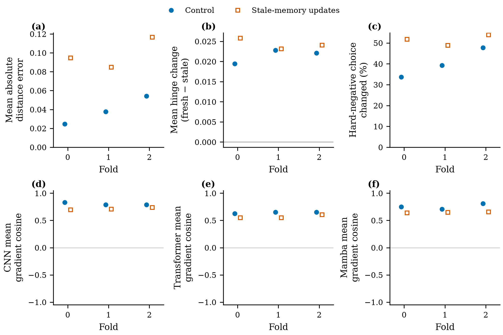

# MSVR310 特征缓存新鲜度诊断图：完整预检与来源绘图准备

预检图使用已核验的全部72更新（三fold×两端×12更新），不是完整来源训练结果，也不是Q1或官方检索结果。每端包含2次warmup、1次首次填充、9次已有历史候选的更新。正式来源绘图必须等原六端及完整CPU终态；本次没有运行source绘图分支。

[矢量PDF](../evidence/msvr310_freshness_preflight_figures_20260908/msvr310_freshness_preflight.pdf) · [详细图注](../evidence/msvr310_freshness_preflight_figures_20260908/caption.txt) · [逐点数据及SHA](../evidence/msvr310_freshness_preflight_figures_20260908/plot_receipt.json) · [复核记录](../evidence/msvr310_freshness_preflight_figures_20260908/fresh_review.md)

## 统计含义

- (a) 只统计当前anchor与历史候选的欧氏距离误差。表示先单位归一化，按真实pair数加权，分母为64×历史候选曝光；不混入当前batch peers的距离。
- (b) 同一当前参数、同一批内计算图及相同历史样本/增强下，重新编码历史坐标后的expanded hinge减去旧缓存hinge。
- (c) 困难负例选中记录发生改变的次数除以64×历史更新数；每端预检分母576。改变记录不一定意味着改变身份。
- (d–f) 同一角色encoder参数块上的stale/fresh expanded loss诊断梯度余弦，再对有效更新取均值。当前peers保留反传，历史候选两边均detach；Control实际更新仍使用原批内项，fresh loss不更新模型。

全部六端分别展示，不跨fold求总体均值/置信区间，不把训练曝光当独立身份样本。无历史项保留缺失，未定义余弦按计数披露而不是填零；本次三角色未定义计数均为0。完整源轨迹若出现其他分布，应如实绘制，不预设预检结论。

## 实际检查

独立上下文Codex复核重新计算全部72条CPU文本，36个绘图数值与原始重聚合零差异；18个角色摘要各9个有效梯度见证，0未定义。图注按复核补清cache-fill更新、历史pair分母及诊断梯度与实际Control更新的区别。该复核为same-family、provisional，不能称为跨模型审计或模型方法有效性证明。

PNG与PDF独立栅格化均已自查；PDF一页、78个文本span均在页面内、0嵌入栅格图像。生成器通过实际预检执行、AST和ruff F检查；所有图像/图注/输入数据/CPU文本记录SHA。source分支尚未执行，不能称其绘制已验证。

输入重聚合SHA：f21de761fe76fa9d910536883f51294cd05ff0ac9d2e6021667e0fb31d3a4641。原CPU SHA：7734737ab898be8679f23a807a4007b132dc09e0a7fc79a00305b5506a6f6782。输入全文已在evidence/msvr310_freshness_epoch_age_preflight_20260907/归档；此次不重复复制模型或实验矩阵。

## 原任务及接续

2026-09-08T00:23:16.002855+08:00实查：3/6端完成，fold1 instance_memory达13/20epoch；原wrapper185622/source186000仍存在，主盘5,140,942,848B（约4.79GiB）。本次只增加报告工具，不修改冻结ab67d4c执行源、f3a0634配置或原EXPERIMENT_PLAN。此前冗余权重/传输包清理已归档，本次没有再删权重。

预计9月8日01:10–01:20完整来源结束，随后全CPU。等原source与source_cpu均退出0且pipeline终态后：接收全部文本及SHA，执行完整重聚合，再运行tools/analyze_msvr_freshness_epochs.py，最后用tools/plot_msvr_freshness_diagnostics.py的source模式读取这份完整结果。正式图仍需实际渲染复核。禁止用部分端图表定下一版参数或提前判断泛化收益。总Goal持续active/unmet。
