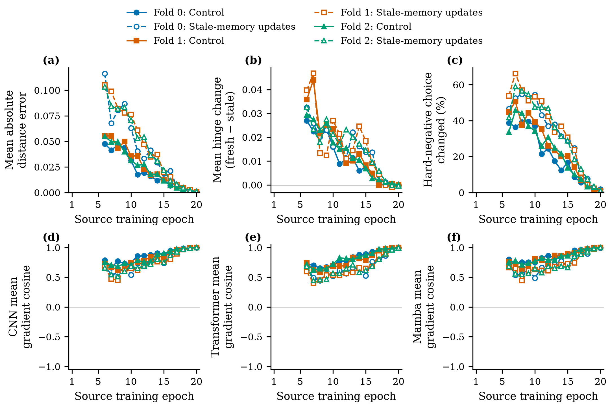

# MSVR310 完整来源缓存坐标诊断

完整六端诊断与CPU核验通过。历史坐标近似在训练期间明显改变困难候选与角色参数梯度；终点接近稳定不能代表整个训练期间都可忽略漂移。该结果不证明新鲜缓存会提高未知身份检索，也不改写原实例记忆Q1的负结果。

## 执行与覆盖

固定执行ab67d4cd18b0a2b010a46702ac01d03df1c3b1de，配置f3a063499b125ef7e90e1b304324a40c967b8d61ba940a6e3193dab5919edae4；冻结计划与两工具未改变。run `/root/autodl-tmp/trifusion-v2/artifacts/msvr310_freshness_v1_seed42_ab67d4c`。

source186000于2026-09-08T01:07:56.571971+08退出0，耗时6781.1187秒；source_cpu191987于01:08:08.768637退出0，耗时12.1956秒；原wrapper于01:08:09结束，状态COMPLETE_VERIFIED_SOURCE_FRESHNESS。01:19:41实查原进程均已结束，GPU1MiB/0%，主盘剩余4,926,001,152B。没有重启、没有新删权重。

全部3fold×2更新端×260步=1560更新，20epoch/端，B64/K8。每端65预热步、1次首次填充、194历史更新，历史anchor暴露12416。780对batch索引与三模态像素SHA一致；203/203可训练张量梯度、0AMP溢出、冻结Signal/CLIP、RNG/buffer保留、真实B64零更新重编码逐位一致及compact严格重载均通过。新增585,600条角色记录前向，含每端64条零更新验证；峰值allocated约6558–6562MiB。重编码有实际训练成本，无推理结构改变。

独立CPU全量检查51,860,992距离元素。17份文本共59,343,243B全部与远端size/SHA相同；全部1560审计行再次重聚合为120epoch、960年龄、360角色epoch组。原图、模型与二进制距离矩阵保留远端。

summary SHA b1b074a993b0da4468aac5ebd4dc8a3af18c999299f0d45c04e3e52398d97401；CPU SHA 98c1daf42a90f065151496eaf9625f336c008b91c0054c35b0587609e1a40ce6。

## 全部历史更新的结果

距离误差仅按anchor×历史候选对加权；hinge与梯度余弦按有历史的更新平均。变化表示选中了不同candidate record，不必是不同身份。Control仍用批内度量项更新；instance_memory仍用陈旧缓存扩展项更新。两端均在同一当前图上测量stale/fresh expanded项，不将诊断梯度误称为全部14项loss的总更新梯度。

| fold/更新端 | 距离绝对误差 | fresh−stale hinge | 负例选择变化 | 梯度余弦 C/T/M |
|---|---:|---:|---:|---|
| 0/control | 0.01978827 | +0.01057180 | 2512/12416 (20.2320%) | 0.865055/0.829519/0.861091 |
| 0/instance_memory | 0.03914664 | +0.01422651 | 4006/12416 (32.2648%) | 0.769041/0.673947/0.741801 |
| 1/control | 0.02406226 | +0.01412248 | 3037/12416 (24.4604%) | 0.819124/0.792022/0.835845 |
| 1/instance_memory | 0.04347634 | +0.01596467 | 4275/12416 (34.4314%) | 0.739347/0.660366/0.726057 |
| 2/control | 0.02233056 | +0.01251498 | 2775/12416 (22.3502%) | 0.837976/0.823544/0.847984 |
| 2/instance_memory | 0.04191304 | +0.01532643 | 4079/12416 (32.8528%) | 0.757981/0.671926/0.727486 |

全部194×6×3=3492次角色梯度比较，fresh/stale差异范数均大于重复同一stale loss的数值差异；未定义余弦0。当前batch peers保留梯度，历史新旧特征都detach。CPU核对运行时梯度见证及绑定，没有独立重跑模型反传。少数负余弦是新旧坐标的诊断差异，不是已证明不同任务存在PCGrad适用的梯度冲突。

每端历史候选暴露分别58133、59505、59984（同fold两端一致）。历史距离对共22,735,616；加上当前距离与新旧历史矩阵得到完整CPU元素计数。全部年龄1–8的曝光机会及误差在all_ages.csv报告，不只计被选中赢家。

| fold/更新端 | 正例选择变化 | 旧错→新对 | 旧对→新错 | loss差正/负步数 |
|---|---:|---:|---:|---|
| 0/control | 430 | 168 | 332 | 149/45 |
| 0/instance_memory | 683 | 354 | 565 | 138/56 |
| 1/control | 599 | 162 | 485 | 159/35 |
| 1/instance_memory | 802 | 336 | 638 | 143/51 |
| 2/control | 443 | 156 | 427 | 167/27 |
| 2/instance_memory | 636 | 321 | 599 | 150/44 |

上表“错/对”指来源batch-hard零间隔关系，不是完整检索Rank-1修复/新增错误。freshloss六端全程均值较高，但每端仍有27–56步降低；不能说陈旧缓存一定制造更困难负例。新鲜几何揭示的原来被掩盖关系多于反向情况，也不能据此声称模型检索退化。

## 终点与完整过程不同

| fold/更新端 | 距离绝对误差 | 负例选择变化/832 | fresh−stale hinge | 梯度余弦 C/T/M |
|---|---:|---:|---:|---|
| 0/control | 0.00060727 | 4 (0.4808%) | -0.00005905 | 0.997890/0.997935/0.998157 |
| 0/instance_memory | 0.00088782 | 15 (1.8029%) | -0.00040182 | 0.997229/0.996326/0.996647 |
| 1/control | 0.00064728 | 7 (0.8413%) | -0.00003578 | 0.998384/0.998212/0.998812 |
| 1/instance_memory | 0.00079861 | 6 (0.7212%) | -0.00037276 | 0.998150/0.998248/0.996881 |
| 2/control | 0.00070100 | 9 (1.0817%) | +0.00007858 | 0.998090/0.997567/0.997855 |
| 2/instance_memory | 0.00071552 | 8 (0.9615%) | -0.00034848 | 0.998887/0.996843/0.997546 |

最后一轮距离误差约0.00061–0.00089，负例变化约0.48%–1.80%，角色余弦均大于0.996；而完整记忆更新轨迹误差约0.039–0.043、负例变化约32%–34%、Transformer余弦约0.660–0.674。仅用终点“慢漂移”推断整个缓存训练可靠不成立。此处没有挑epoch或按结果选择新的缓存年龄。

## 图表与证据边界

实际source图从全1560CPU行生成，720个绘图字段中540有效、180无历史为null；未把前5epoch补成0。三折六条轨迹分别展示，不绘制混合fold均值或置信区间。根代理实际打开PNG及PDF渲染；矢量PDF单页、无raster object、全部文字位于页面内。新上下文同模型家族复核全部720字段零差异；review_independence=same-family，acceptance_status=provisional。详见figure_review.md与生成回执。

本实验的新鲜loss更新次数为0，heldout/official图片读取0；这些是新诊断训练轨迹，不是原Q1逐位重放。原实例记忆V1融合−0.216156pp及两组0/5失败继续封存。不能由来源诊断推出陈旧坐标是其唯一原因，也不能把重新编码、XBM或GradCache改名为原创。

## 下一项待固定干预

当前证据支持登记一次“相同历史候选的陈旧坐标更新 vs 当前角色重编码坐标更新”配对实验。保持同一候选索引、年龄、视图、停止梯度边界、其余13项监督、初始化、训练预算及检索协议；双方均执行同样的重编码以匹配额外计算。真正唯一改变是扩展度量项选择哪一套历史坐标。不能同时增加历史样本反传、新anchor、GradCache、年龄扫描或新融合。

这仍须新配置/计划、真实M0及全部Q1核验；本报告没有启动该实验或认定有效。完整长期Goal保持ACTIVE/UNMET。

证据目录：`evidence/msvr310_freshness_complete_source_20260908/`。包含全部17原始文本、三张全量CSV、完整重聚合、文本分析工具、观察状态、PNG/PDF/图注/LaTeX和hash回执。
