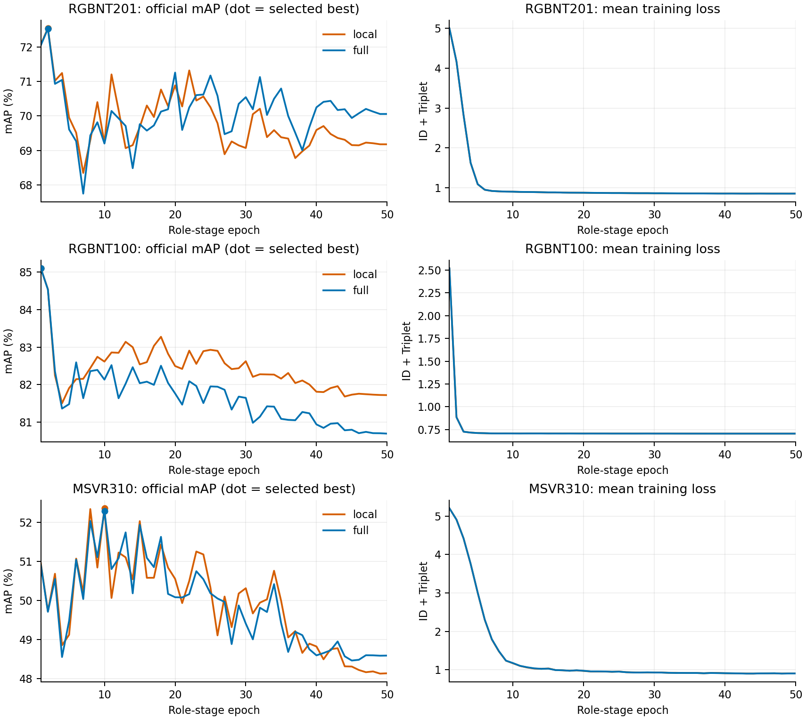

# Patch-memory matched panel: six complete endpoints

All local/full × RGBNT201/RGBNT100/MSVR310 endpoints completed50 role-stage epochs and strict reload of one official-fused-mAP-best checkpoint. The recovery controller terminated successfully; the original September30 hardware-failed campaign remains preserved. Two previously completed trainings were separately evaluated after recovery; four missing endpoints were fresh full50 attempts. An old missing process exit code is not reconstructed as a successful training exit.

| Dataset | Memory | Selected epoch | mAP | Rank-1 | Rank-5 | Rank-10 |
|---|---|---:|---:|---:|---:|---:|
| RGBNT201 | local9 | 2 | 72.5442 | 73.9234 | 83.1340 | 88.0383 |
| RGBNT201 | full128 | 2 | 72.5335 | 73.9234 | 82.6555 | 87.9187 |
| RGBNT100 | local9 | 1 | 85.1030 | 95.1020 | — | — |
| RGBNT100 | full128 | 1 | 85.1048 | 95.1020 | — | — |
| MSVR310 | local9 | 10 | 52.3622 | 67.8511 | — | — |
| MSVR310 | full128 | 10 | 52.2919 | 67.8511 | — | — |

Vehicle R5/R10 remain in raw receipts. Every row uses the same selected checkpoint for all its metrics; no epoch/seed column mixing. This is a second50-epoch stage on dataset-trained pure CLIP ReID weights (prior50 epochs for201/MSVR,30 for100), not a50-epoch total training from public CLIP.

## Registered advancement gate: FAIL

Full minus local mAP/R1(pp):201 −0.010688/0;100 +0.001768/0;MSVR −0.070324/0. The original requirement was positive mAP and nondecreasing R1 in every dataset, plus at least+0.5mAP on201/MSVR. No gate, seed, coefficient or checkpoint policy was changed. Gate-conditioned full-memory global-only and multiseed follow-ups are not started.

Both modes have matched initial state and trainable parameter counts within each dataset. Both execute Q/K/V/output projections; only allowed Patch support changes. Original verification recomputes all6×3 distance outputs and4 metrics with full gallery order and dataset labels. The source manifest binds210 frozen runtime files. No M3, local auxiliary identity target, reranking or environment change was introduced.

## Full-query and selected-content diagnosis

| Dataset | R1 repairs / new errors | Query AP improved / worsened | Identity AP improved / worsened | Identity-macro ΔAP pp |
|---|---:|---:|---:|---:|
| RGBNT201 | 1 /1 | 235 /195 | 16 /9 | −0.00323 |
| RGBNT100 | 0 /0 | 591 /667 | 18 /28 | −0.00309 |
| MSVR310 | 5 /5 | 236 /305 | 19 /31 | +0.11418 |

These describe two fixed, selected models. Identity bootstrap intervals are not training-seed uncertainty or independent held-out significance. Formal mAP continues to use the original query average, not identity weighting.

| Dataset | Query / gallery rows per mode | Selected-content cosine local→full | Attention cosine local→full | Effective Patch count local→full |
|---|---:|---:|---:|---:|
| RGBNT201 | 836 /836 | 0.6265→0.9864 | 0.0378→0.9507 | 7.8569→112.8362 |
| RGBNT100 | 1715 /8575 | 0.7387→0.9800 | 0.0364→0.9426 | 7.7031→96.9999 |
| MSVR310 | 591 /1055 | 0.6554→0.9857 | 0.0312→0.9648 | 5.1862→67.2323 |

Values average3roles×3modalities on all query inputs; gallery/per-role tables are retained. The unchanged hook returns original samples. Model state hashes remain unchanged; first-batch hooked/unhooked outputs and full-gallery retrieval reproduce the selected models within1e-5pp. Sampling statistics precede anchor addition, bridges and role processing; local masking mechanically limits attention overlap. Similar sampled content does not prove final role identity redundancy, physical correspondence or a unique reason for the negative retrieval increments.

RGBNT100 diagnostics have actual CPU/GPU child wait exit0, finished02:45:15/02:47:45. Earlier201/MSVR GPU diagnostics have COMPLETE artifacts and absent processes but no retained wait parent; no OS exit code is fabricated for those earlier jobs.

## All50-epoch trajectories

[Editable SVG](patch_memory_complete_20261001/trajectories.svg), [SHA-bound numerical summary](patch_memory_complete_20261001/SUMMARY.json), producer [report_patch_memory_complete.py](../tools/report_patch_memory_complete.py).

Final minus best mAP local/full(pp):201 −3.3664/−2.4758;100 −3.3810/−4.4099;MSVR −4.2276/−3.7031. All mean losses decrease.100 has zero positive Triplet in all6559 steps per mode. MSVR still has positive Triplet in771/800 and766/800 post-best steps; absence of hinge supervision is therefore not an explanation established across all datasets. Scalar activity is not an AdamW update share or unique causal attribution.

## What is established and what remains open

Expanded Patch access did not provide meaningful consistent retrieval gain in this matched panel. This does not invalidate every content-attention design. Shared-global/joint-local decompositions use the same trained upstream adapters and are not independent global-only or pure-role training controls. The original target of exceeding matched baselines and qualified current strong methods across all three datasets remains unmet.

The [primary-source slot review](../refine-logs/patch_memory_roles_v1/SLOT_COMPETITION_PRIOR_ART_20261001.md) documents Slot Attention, DINOSAUR and the direct image/text retrieval precedent PLOT. Competition or shared slots cannot be claimed as original. Any later experiment must distinguish the attention allocation intervention from iterative updates, extra reconstruction/identity supervision or a new pretrained source; none was implemented by this analysis.

Primary evidence: `logs/patch_memory_complete_intake_20261001/accepted_matrix.json` SHA35067bce6690e86e43a08f963ddc259ade704549d899f8b2ce58cfb1dcb3aa56; original six run/M0 paths in that matrix;29 byte-verified complete-intake members; earlier four raw runs in their original intakes;11 byte-verified100 diagnostic members; six complete slot reports. Weights, probes and distance arrays remain remote.

The [fresh integrity review](../refine-logs/patch_memory_roles_v1/INTEGRITY_AUDIT_678_20261001.md) reports WARN, same-family/provisional: independent CPU ranking and production-factory strict loading support the numbers and failed scientific gate. No fresh GPU neural replay was performed by the reviewer. Remote210/210 original source hashes match; local27 files differ only in CRLF/LF and107 dependencies are absent locally. Review helper failures and all original hardware failures remain recorded. This producer report is not its own independent approval.
