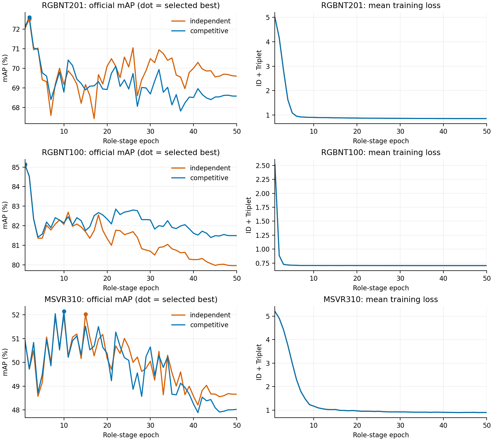

# FP32 slot competition: complete six-end result

All six fresh seed42 endpoints completed 50 role-stage epochs, selected one checkpoint by official fused mAP, and completed strict reload/full-gallery evaluation. All 18 recorded M0/train/evaluate child exits are zero. This is the independent-versus-competitive attention-normalization comparison; both paths use an entirely FP32 attention subgraph. The prior R1 numerical failure remains separate.

## Formal metrics

Each row contains all metrics from its own selected checkpoint. Vehicles' Rank-5/10 remain in the raw receipts.

| Dataset | Normalization | Best epoch | mAP | Rank-1 | Rank-5 | Rank-10 |
|---|---|---:|---:|---:|---:|---:|
| RGBNT201 | Independent | 2 | 72.5114 | 73.8038 | 82.6555 | 87.9187 |
| RGBNT201 | Competitive | 2 | 72.5997 | 74.0431 | 83.1340 | 87.9187 |
| RGBNT100 | Independent | 1 | 85.1076 | 95.0437 | — | — |
| RGBNT100 | Competitive | 1 | 85.1405 | 95.1603 | — | — |
| MSVR310 | Independent | 15 | 52.0319 | 67.5127 | — | — |
| MSVR310 | Competitive | 10 | 52.1479 | 67.1743 | — | — |

| Competitive minus independent | ΔmAP | ΔRank-1 | Rank-1 repairs / new errors | Identity-equal ΔAP |
|---|---:|---:|---:|---:|
| RGBNT201 | +0.0883 | +0.2392 | 3 / 1 | +0.0852 |
| RGBNT100 | +0.0329 | +0.1166 | 2 / 0 | +0.0358 |
| MSVR310 | +0.1161 | −0.3384 | 22 / 24 | +0.4850 |

The registered advancement gate is **FAIL**. RGBNT201 and MSVR310 do not reach +0.5 mAP; MSVR310 also loses Rank-1. The individually passing RGBNT100 pair does not satisfy the three-dataset gate. No gate-triggered global-only experiment, stability seed or coefficient scan is authorized by these results.

## Attention changed, retrieval changed little

These statistics cover every official query, averaged over three roles and three modalities, at the selected checkpoint. They are measured before anchor addition and cross-role bridging. CNN spatial convolution has already run; Transformer and Mamba mixing occurs later.

| Dataset | Independent / competitive effective patches | Independent / competitive attention-slot cosine | Independent / competitive selected-content cosine | Independent / competitive distinct top-1 patches |
|---|---:|---:|---:|---:|
| RGBNT201 | 110.6297 / 122.6034 | 0.9413 / 0.9163 | 0.9813 / 0.9768 | 8.1947 / 15.1204 |
| RGBNT100 | 86.3294 / 113.5050 | 0.9212 / 0.8712 | 0.9593 / 0.9747 | 5.7340 / 12.4176 |
| MSVR310 | 50.6005 / 95.8228 | 0.9539 / 0.8191 | 0.9727 / 0.8825 | 3.0970 / 10.9126 |

Competition increases distinct top-ranked patches and reduces attention overlap. It does not universally reduce selected-content similarity: RGBNT100 moves in the opposite direction. Even the larger MSVR310 change does not deliver the registered retrieval improvement. This limits the explanation that attention overlap alone accounts for the weak role contribution. It does not establish physical part correspondence, final-role redundancy or a unique failure cause.

## Within-checkpoint readout

The global output here is the adapted M1 global, not the original frozen upstream baseline. Local means the normalized projected role correction. These are output decompositions of jointly trained models, not independent training controls.

| Dataset / variant | Global mAP | Local mAP | Fused mAP | Fused minus global mAP | Fused repairs / new errors relative to global |
|---|---:|---:|---:|---:|---:|
| RGBNT201 independent | 72.4527 | 33.4595 | 72.5114 | +0.0588 | 1 / 1 |
| RGBNT201 competitive | 72.4699 | 34.7371 | 72.5997 | +0.1298 | 4 / 2 |
| RGBNT100 independent | 85.0753 | 57.1165 | 85.1076 | +0.0322 | 1 / 1 |
| RGBNT100 competitive | 85.0962 | 55.9657 | 85.1405 | +0.0443 | 2 / 1 |
| MSVR310 independent | 52.1818 | 7.4310 | 52.0319 | −0.1499 | 9 / 15 |
| MSVR310 competitive | 52.5738 | 7.2811 | 52.1479 | −0.4259 | 4 / 15 |

The thin role increment in RGBNT201/RGBNT100 and negative MSVR310 increment persist. The competitive MSVR310 checkpoint has a stronger global than its control, but its role correction incurs a larger loss relative to its own global. That decomposition cannot identify a unique causal mechanism. A weak standalone local ranking also does not imply every local correction is harmful: all four competitive MSVR310 repairs occur where local alone is wrong.

## Complete trajectories and scope

All six mean losses fall after the selected epoch, while final mAP falls: independent/competitive changes are −2.9079/−4.0160 for RGBNT201, −5.1483/−3.6484 for RGBNT100 and −3.3694/−4.1238 for MSVR310. RGBNT100 has zero positive Triplet steps after epoch 1 in both paths; MSVR310 retains 669/700 and 759/800 positive post-best steps. Scalar activity is not AdamW update share or a causal performance attribution.

Official query/gallery counts are RGBNT201 836/836, RGBNT100 1715/8575 and MSVR310 591/1055. Metadata and original camera/time filtering are retained. All six full-gallery neural diagnostics keep model state unchanged, return exact original hook outputs, and match saved metrics within 1e-5 percentage points. Three diagnostic children have actual waited exit codes zero. CPU report execution also returned zero.

This is one development seed, with official data used for epoch selection and historical method decisions. Fixed-model identity bootstrap intervals are descriptive; they do not establish training reproducibility or untouched-test significance. Upstream pure ReID weights were trained before these 50 role-stage epochs. This panel does not achieve the full baseline/SOTA goal or establish three-role necessity.

## Evidence

- [Original text intake and hashes](../logs/slot_competition_fp32_complete_intake_20261001/INTAKE.json): 68 copied raw files, all SHA-verified locally; weights and distance arrays remain remote.
- [Accepted matrix](../logs/slot_competition_fp32_complete_intake_20261001/accepted_matrix.json): SHA256 `e3433db691dbb1070595386c542f27782cd88b45f5f6faa8660b246e7c2fd4b8`.
- [Actual diagnostic waits](../logs/slot_competition_fp32_slot_diagnosis_20261001/EXECUTION.json), completed 06:42:10 CST.
- [Complete analysis](slot_competition_fp32_complete_20261001/SUMMARY.json), completed 06:43:57 CST: SHA256 `94179e2b2ca8810a0a6ee2d7aed5eca001c8aad7b77681fa77a4d4ea3d1c3950`.
- [Executed analysis source](../logs/slot_competition_fp32_analysis_source_20261001.py): SHA256 `2fbe37c00e83672e56e3321cf6f4405dd3d9890b34cecf90ff735b9b5eb825fe`.

Erratum: the preserved SUMMARY and executed analysis source say the slot statistics precede all role operators. That scope is too broad for CNN, whose spatial convolution precedes sampling. The corrected scope above and the current report tool replace that wording; original numbers, raw records and advancement gate remain unchanged.

The next experiment must distinguish a new mechanism from the already completed cross-depth, prompt-state, context/local-ID, Patch-memory and attention-competition comparisons. Initialization-source differences were already recorded; they are not a newly established cause. No new training hypothesis is registered in this report.
