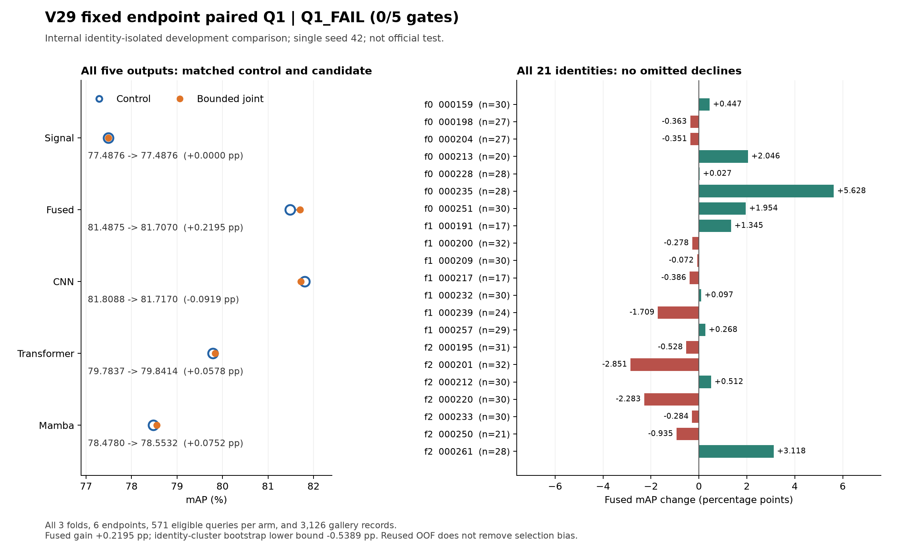

# V29 完整终态：方向边界生效，检索增益仍不稳定

V29于2026-09-07 13:38:11完成训练、全量CPU核验和报告，封存为 **Q1_FAIL，0/5 原科学条件通过**。三折六端、每端固定20epoch、全部3360次正式更新和完整3126条隔离图库均完成；571条合法query来自21个身份。没有选择部分fold、身份或中途checkpoint。

融合mAP由81.4874846980提高到81.7070190620，增益+0.2195343641；CNN -0.0918723450，Transformer +0.0577887793，Mamba +0.0751655938。三折融合增益为+1.3264342011/-0.1400842027/-0.5029371488，身份聚类bootstrap95%下界-0.5389154198。候选融合低于候选CNN 0.0099539899，即使差很小也保持原严格条件。平均增益未达1pp、两个fold下降、CNN聚合下降、bootstrap下界非正、融合非最高，五项均失败。

同协议Signal保持77.4876031160，候选融合仍比它高4.2194159460。因此本次不能写成三角色均不如Signal；它否定的是这个固定b=0.5联合方案相对同初始化V27控制的稳定新增收益。V28的-0.556432和V29的+0.219534来自不同匹配对照，不能相减后声称几何约束独立带来0.775966pp提升。本次也未比较标准MAG限幅或同容量简单头。

[可导出SVG](../evidence/v29_complete_terminal_20260907/v29_complete_paired_comparison.svg)。该图使用全部比较记录；首版图例与脚注重叠，已修正位置后重新生成并实际查看PNG，SVG通过XML解析。数据和训练未改。初版图像留在本机临时目录，失败视觉回执和最终视觉回执均归档。

## 平均增益由哪些变化构成

全部21身份：融合10改善、11下降；571条query的AP有180改善、157下降、234相同。Rank-1修复6条、新增3条，净增加3条正确首位；Rank-5反而从91.068301降至90.893170，Rank-10不变。新增3条错误的首位负例都来自相同摄像头，这只是关联证据，不构造未读取原图的视觉成因。

身份000235和000261的查询加权正贡献合计0.4288511641pp，超过总净收益0.2195343641pp；全部正贡献0.7136896724pp被负贡献-0.4941553083pp抵消。全身份表及全部2855条query-输出CSV随证据保留，不用两个成功身份替代总体。Transformer虽然聚合只提高0.057789pp，三fold分别约+3.236190/-1.839108/-1.250884，平均很小不代表各fold变化很小。

## 几何边界确实生效，但终点整体贴近边界

所有3360步及全部52个检索批次的保存几何统计均复算：训练1935360个槽位曝光、检索56268个槽位曝光；候选占各自一半。实际相对范数最大0.5000000596、最小余弦0.8944270015，最大角26.5650754583度，在注册b=0.5及2e-6浮点容差内。控制零修正余弦的微小偏差来自浮点内积，不解释为真实旋转。

| fold | 全图库槽位数 | 更新相对范数加权均值 | 更新前后余弦加权均值 | 实际最大相对范数 | 实际最小余弦 |
|---|---:|---:|---:|---:|---:|
| 0 | 9000 | 0.4999650903 | 0.8944397602 | 0.4999999702 | 0.8944271207 |
| 1 | 9459 | 0.4999985655 | 0.8944277014 | 0.5000000596 | 0.8944270611 |
| 2 | 9675 | 0.4999973232 | 0.8944281835 | 0.5000000596 | 0.8944270611 |

三个候选端完整图库的槽位加权均值都贴近0.5上限/0.894427余弦下界。这里是全批次保存均值与极值的汇总，不冒称已重新取得每个槽位的分位数分布。该证据支持有界映射在终点整体接近饱和，不能声称原始联合输出被压小：全1680步的joint_correction_abs_mean平均121.7696453568，最终epoch全部84批平均137.0273528411。

因此，“限定方向改动”与“学习有价值的方向”仍需区分。当前h到修正y受到边界约束，但h本身仍随fused和角色辅助监督训练；初始化到终点的角色几何漂移尚未完整测量。仅看向量夹角也不足以证明身份信息损失，共同正交旋转可改变坐标却保留样本间相似度。也没有真实参数导数诊断证明有界映射饱和是本次唯一失败原因。

## 完整训练目标与实际成本

全1680步/端：总loss0.6802413188→0.6800979512，加权ID0.6595103926→0.6586102331，加权Triplet0.0207309124→0.0214877038。最终epoch的84批总loss0.6179574260→0.6185962160，fused Triplet0.0030891974→0.0035008523，正loss批数61→65。小幅分类改善没有使全部度量关系同步改善；不由此推断梯度冲突。

每个控制端203/203、候选端219/219可训练张量在整个训练阶段均有真实非零梯度，overflow0、冻结状态不变。这是阶段覆盖，不意味着每一步所有张量都非零。全部六个终点权重均在原runner严格重载后完整检索，CPU核验阶段只检查权重SHA并加载六份检索数组，没有重新实例化模型。

控制总训练2083.9148812294秒，候选2164.8461203575秒，观察到增加3.883615%；峰值reserved6022→7610MiB。新增413056可训练参数及两次1152Token扫描保留；本页不把训练时间冒称推理延迟或FLOPs。本轮前置M0为116步，Q1独立从合法原初始化开始；旧V28失败/精度诊断成本另行封存。

## 完整核验与存储

原训练PID153151于13:38:00退出0，CPU158223于13:38:10退出0，报告158273于13:38:11退出0，wrapper153149同样正常结束；13:42现场核对四PID均已不存在、GPU空闲。运行代码始终f4c6a03e1b263aaa9e4bce71427152007018a0ca，原配置/计划/源码绑定没有变更。

CPU复算32602260个距离与5952790个完整排名位置，距离/指标误差0；本地另行复算3360步14项loss、五输出、21身份10000次bootstrap与五门，loss最大误差1.7423493159e-7、指标误差0。执行器两地复核不是外部独立审计。

终态摘要SHA5993165ca4cd00bbea9213701d31258cd3331d4ab631f0d43a2ccfba571430b6；
CPU核验SHA49d4c92eb201d0b57d3845135fd4696113859cbf8979b8f5a870764049a3a3f5。
32个原始文本/JSON/CSV/log文件共30845895B全部SHA与字节核对。实际权重/图像/检索张量留远端，本机没有Torch或模型调用。目录1018769611B，数据盘可用13187350528B（约12.282GiB），本轮新增删除0，既有24权重清理回执保持。

## 下一步的证据问题

本方案不晋级，不扫描b、重新挑终点或追加V26/Router/记忆库。先补齐来源侧固定输入上的初始化、普通终点和候选终点角色关系变化，区分：原角色训练漂移、同一次前向的联合修正，以及来源扰动下原本稳定关系是否受损。比较应同时包括实际单位向量变化和样本间身份相似度/间隔，防止把纯坐标变化当成能力损失。

这项零更新诊断尚未登记或启动，不能写成已经证明需要DELTA式保留损失。若来源真实关系本身仍近乎饱和、没有可辨的新损害，继续叠加保留目标同样缺少依据。诊断使用全部注册source范围，不用官方身份或部分OOF优例来定预算；新训练须另立单一假设合同。

当前结构详见[网络与监督说明](../docs/V29_CURRENT_NETWORK_AND_SUPERVISION.md)：原V8角色+V27耦合扰动，候选以固定切向边界更新九个槽位；原独立角色输出仍训练，不是冻结教师。V27原有配对正收益、RGBNT100官方相对Signal增益、MSVR310负结果、RGBNT201固定dev不足均保持；三数据集达到baseline/SOTA的总目标未完成。单seed42/反复OOF不是独立泛化证明，当前81.7070不能与文献官方SOTA直接相减。

以下附远端自动生成的完整比较，不删任何fold、身份、输出或负结果。

---

# V29 固定切向几何约束联合适配：完整三折六端比较

生成时间：2026-09-07T13:38:11.427099+08:00。科学状态 **Q1_FAIL**。
六端固定20epoch、3360优化步完整完成，全部原始数组和排序经CPU全量复算。
fused mAP相对本轮control增益+0.219534pp；三fold增益+1.326434/-0.140084/-0.502937pp。
全21身份、10000次bootstrap的95%下界-0.538915pp。

本次为重复使用的训练内部身份隔离Q1开发资格，不是固定30-dev或官方测试。
完整141个heldout身份的3126条图库记录保留；571条合法query来自21个跨摄像头身份。
其余2555条只从query分母排除，仍留作图库干扰。仅评分固定epoch20，未选择中间终点。

## 全部五路指标

| 输出 | control mAP | candidate mAP | mAP增益 | control R1 | candidate R1 | control R5 | candidate R5 | control R10 | candidate R10 |
|---|---:|---:|---:|---:|---:|---:|---:|---:|---:|
| baseline_only | 77.487603 | 77.487603 | 0.000000 | 79.334501 | 79.334501 | 89.492119 | 89.492119 | 93.520140 | 93.520140 |
| fused | 81.487485 | 81.707019 | 0.219534 | 84.063047 | 84.588441 | 91.068301 | 90.893170 | 95.271454 | 95.271454 |
| cnn | 81.808845 | 81.716973 | -0.091872 | 85.639229 | 85.288967 | 89.667250 | 89.667250 | 92.119089 | 92.469352 |
| transformer | 79.783653 | 79.841442 | 0.057789 | 85.288967 | 85.288967 | 93.695271 | 94.220665 | 95.446585 | 96.322242 |
| mamba | 78.478007 | 78.553173 | 0.075166 | 80.035026 | 80.210158 | 89.141856 | 88.791594 | 93.695271 | 93.870403 |

## 三折两端五路完整结果

| fold | gallery | query | 输出 | 端点 | mAP | R1 | R5 | R10 |
|---|---:|---:|---|---|---:|---:|---:|---:|
| 0 | 1000 | 190 | baseline_only | control | 68.767642 | 69.473684 | 80.526316 | 86.315789 |
| 0 | 1000 | 190 | baseline_only | bounded_joint | 68.767642 | 69.473684 | 80.526316 | 86.315789 |
| 0 | 1000 | 190 | fused | control | 71.947623 | 71.052632 | 78.947368 | 87.368421 |
| 0 | 1000 | 190 | fused | bounded_joint | 73.274057 | 72.105263 | 80.000000 | 87.368421 |
| 0 | 1000 | 190 | cnn | control | 72.746043 | 72.631579 | 77.894737 | 81.578947 |
| 0 | 1000 | 190 | cnn | bounded_joint | 72.619666 | 72.631579 | 77.368421 | 82.631579 |
| 0 | 1000 | 190 | transformer | control | 71.237753 | 73.684211 | 85.789474 | 89.473684 |
| 0 | 1000 | 190 | transformer | bounded_joint | 74.473943 | 79.473684 | 88.421053 | 91.578947 |
| 0 | 1000 | 190 | mamba | control | 69.868156 | 65.789474 | 75.789474 | 82.631579 |
| 0 | 1000 | 190 | mamba | bounded_joint | 69.779843 | 66.315789 | 75.263158 | 83.684211 |
| 1 | 1051 | 179 | baseline_only | control | 88.678240 | 93.296089 | 99.441341 | 100.000000 |
| 1 | 1051 | 179 | baseline_only | bounded_joint | 88.678240 | 93.296089 | 99.441341 | 100.000000 |
| 1 | 1051 | 179 | fused | control | 91.962089 | 97.765363 | 100.000000 | 100.000000 |
| 1 | 1051 | 179 | fused | bounded_joint | 91.822005 | 97.206704 | 100.000000 | 100.000000 |
| 1 | 1051 | 179 | cnn | control | 94.384376 | 99.441341 | 100.000000 | 100.000000 |
| 1 | 1051 | 179 | cnn | bounded_joint | 94.474320 | 100.000000 | 100.000000 | 100.000000 |
| 1 | 1051 | 179 | transformer | control | 89.727789 | 95.530726 | 100.000000 | 100.000000 |
| 1 | 1051 | 179 | transformer | bounded_joint | 87.888681 | 92.737430 | 98.882682 | 100.000000 |
| 1 | 1051 | 179 | mamba | control | 89.640299 | 95.530726 | 98.882682 | 99.441341 |
| 1 | 1051 | 179 | mamba | bounded_joint | 89.691277 | 95.530726 | 98.882682 | 100.000000 |
| 2 | 1075 | 202 | baseline_only | control | 75.773091 | 76.237624 | 89.108911 | 94.554455 |
| 2 | 1075 | 202 | baseline_only | bounded_joint | 75.773091 | 76.237624 | 89.108911 | 94.554455 |
| 2 | 1075 | 202 | fused | control | 81.178671 | 84.158416 | 94.554455 | 98.514851 |
| 2 | 1075 | 202 | fused | bounded_joint | 80.675734 | 85.148515 | 93.069307 | 98.514851 |
| 2 | 1075 | 202 | cnn | control | 79.189600 | 85.643564 | 91.584158 | 95.049505 |
| 2 | 1075 | 202 | cnn | bounded_joint | 78.969068 | 84.158416 | 92.079208 | 95.049505 |
| 2 | 1075 | 202 | transformer | control | 79.009994 | 87.128713 | 95.544554 | 97.029703 |
| 2 | 1075 | 202 | transformer | bounded_joint | 77.759110 | 84.158416 | 95.544554 | 97.524752 |
| 2 | 1075 | 202 | mamba | control | 76.685045 | 79.702970 | 93.069307 | 99.009901 |
| 2 | 1075 | 202 | mamba | bounded_joint | 76.935411 | 79.702970 | 92.574257 | 98.019802 |

## 全部21个身份

身份原名取自原gallery文件名，并保留loader编码。配套CSV包含每身份每输出的全部mAP和Rank-1/5/10。
以下列出全部身份的mAP增益，没有省略下降身份。

| fold | 原始身份 | query | Signal增益 | fused增益 | CNN增益 | Transformer增益 | Mamba增益 |
|---|---|---:|---:|---:|---:|---:|---:|
| 0 | 000159 | 30 | +0.000000 | +0.446780 | -0.533715 | +1.026259 | -0.157394 |
| 0 | 000198 | 27 | +0.000000 | -0.362695 | -0.105657 | -1.789544 | -0.134894 |
| 0 | 000204 | 27 | +0.000000 | -0.351229 | +0.809833 | -4.191490 | -0.763430 |
| 0 | 000213 | 20 | +0.000000 | +2.046209 | +2.850035 | +9.249821 | +1.945400 |
| 0 | 000228 | 28 | +0.000000 | +0.027056 | +0.000000 | +0.056572 | +0.000000 |
| 0 | 000235 | 28 | +0.000000 | +5.627817 | -3.671116 | +13.982593 | -1.108647 |
| 0 | 000251 | 30 | +0.000000 | +1.954481 | +0.625916 | +5.582773 | +0.144378 |
| 1 | 000191 | 17 | +0.000000 | +1.344810 | +1.099423 | +1.750875 | -1.826066 |
| 1 | 000200 | 32 | +0.000000 | -0.278304 | +0.435776 | -1.040960 | -0.000803 |
| 1 | 000209 | 30 | +0.000000 | -0.071614 | +0.282245 | -0.481034 | -0.027056 |
| 1 | 000217 | 17 | +0.000000 | -0.385715 | -2.058199 | -6.281658 | +0.920171 |
| 1 | 000232 | 30 | +0.000000 | +0.097288 | +0.079649 | +0.298150 | +0.112492 |
| 1 | 000239 | 24 | +0.000000 | -1.709468 | +0.017861 | -9.478712 | +1.025338 |
| 1 | 000257 | 29 | +0.000000 | +0.268380 | +0.247205 | +0.486530 | -0.090353 |
| 2 | 000195 | 31 | +0.000000 | -0.527880 | +0.463817 | -1.427243 | +2.304049 |
| 2 | 000201 | 32 | +0.000000 | -2.850853 | +2.129629 | -1.471688 | -4.662123 |
| 2 | 000212 | 30 | +0.000000 | +0.511993 | -0.609532 | -6.004828 | +0.552914 |
| 2 | 000220 | 30 | +0.000000 | -2.283293 | -6.064777 | -1.135695 | -1.809939 |
| 2 | 000233 | 30 | +0.000000 | -0.284364 | +1.732599 | -2.253820 | -0.304983 |
| 2 | 000250 | 21 | +0.000000 | -0.934616 | -1.098221 | -1.383459 | +2.304765 |
| 2 | 000261 | 28 | +0.000000 | +3.117683 | +1.580002 | +5.340822 | +4.528442 |

## 全部query的变化

AP改善/下降/相等计数采用AP单位1e-12容差，仅用于计数；指标和科学门保持原全精度。
逐query CSV包含全部571×5=2855行及候选首位图库记录，JSON也保留全部原始比较。

| 输出 | AP改善 | AP下降 | AP相等 | R1修复 | R1新增错误 |
|---|---:|---:|---:|---:|---:|
| baseline_only | 0 | 0 | 571 | 0 | 0 |
| fused | 180 | 157 | 234 | 6 | 3 |
| cnn | 191 | 153 | 227 | 3 | 5 |
| transformer | 169 | 219 | 183 | 13 | 13 |
| mamba | 167 | 193 | 211 | 6 | 5 |

## 原科学条件

| 条件 | 判定 |
|---|---|
| aggregate_fused_gain_at_least_1pp | FAIL |
| all_fold_fused_nonnegative | FAIL |
| all_expert_aggregate_nonnegative | FAIL |
| fused_bootstrap_lower_positive | FAIL |
| fused_beats_baseline_and_experts | FAIL |

## 实际训练与成本

control参数98,800,141/可训练7,841,292/203张量；candidate新增413,056参数和16张量，总99,213,197/可训练8,254,348/219张量。
相同V12合法起点、原七组ID/Triplet、单视图共享几何、B64/K8、seed42、固定20epoch。
两端共同使用固定V27风格增强，原14项loss全部保留；候选为池化前1152Token联合聚合加固定b=0.5切向约束；joint与几何计算均FP32，控制为原固定融合。
两端所有实际batch与同一原采样清单逐项一致；输入顺序、全部source曝光和前八批增强SHA相同。
跨摄像头正对两端均8.070790816%；重复照片按训练曝光计数，不当作独立关系。
未加入V23模态MLP、V24原型/亮度双视图、V25采样、V26责任loss、MCNL或Router；稠密三角色推理保持。
每端从合法原始模型重新构造；M0权重没有用于Q1；最终checkpoint严格重载后才检索。

| fold | endpoint | 更新 | 样本曝光 | 跨相机正对% | reserved MiB | 训练秒数 |
|---|---|---:|---:|---:|---:|---:|
| 0 | control | 580 | 37120 | 8.234298 | 6022.000 | 718.915 |
| 0 | bounded_joint | 580 | 37120 | 8.234298 | 7610.000 | 746.830 |
| 1 | control | 560 | 35840 | 8.532366 | 6022.000 | 694.639 |
| 1 | bounded_joint | 560 | 35840 | 8.532366 | 7610.000 | 722.194 |
| 2 | control | 540 | 34560 | 7.416501 | 6022.000 | 670.361 |
| 2 | bounded_joint | 540 | 34560 | 7.416501 | 7610.000 | 695.822 |

原训练过程总耗时4748.574秒；包括M0和终点评价。
没有跨fold特征距离、dev/official访问、reranking、测试时训练或预成功消融。

## 完整证据与边界

- 训练执行commit：f4c6a03e1b263aaa9e4bce71427152007018a0ca。
- 原终态摘要SHA256：5993165ca4cd00bbea9213701d31258cd3331d4ab631f0d43a2ccfba571430b6。
- 全量CPU核验SHA256：49d4c92eb201d0b57d3845135fd4696113859cbf8979b8f5a870764049a3a3f5。
- 报告生成器SHA256：750414f3c46d960810bc1489d60ad643a8fec55fb4754985e798d9747fdade2d。
- 6个完整终点权重及全部特征/距离/排名数组留在服务器；本地仅处理JSON、CSV与文本。
- 工程核验PASS不代表科学Q1_PASS。外部独立审计额度不可用，执行器核验不得标为独立审计。
- 本次21个身份已反复用于开发，bootstrap不能消除选择偏差。
- 保留原五项科学门及任何负结果；不得按本次结果扫描隐藏宽度、池化位置、扫描顺序、p/alpha、seed、epoch或新loss。

## 联合表示的范围

新联合头读取原角色最终Patch残差，经共享投影及双向Mamba后产生零初始化修正。
V29沿用V28已验证的joint局部FP32；零初始化修正先投影切向并平滑限制相对范数到0.5，再归一化。
三个独立分支和各自纯残差仍采用原读出；其辅助监督没有被联合头替换。
新fused相似度不再等于报告的三个独立分支相似度平均。
本比较包含新增参数/计算，不能单独证明几何约束优于标准MAG限幅或同容量简单头；主结果成立后才登记这些对照。
完整Token聚合受MambaPro启发，非作者完整复现或已证明的首创。
相对范数及归一化方向更新分别有MAG/nGPT先例；切向投影、限幅本身不主张原创。
[MAG](https://aclanthology.org/2020.acl-main.214.pdf)、[nGPT](https://arxiv.org/html/2410.01131v2)、[MambaPro](https://arxiv.org/html/2412.10707v1)。

## 完整训练中的统计扰动

两端均按同一p0.5/alpha0.1计划实际采用stem统计混合，供体与激活批次完全匹配。
三模态共享供体行及混合系数，各自使用同光谱统计，角色anchor与reference使用同一扰动。
原Signal prefix始终来自原输入路径。推理无扰动、无额外CLIP视觉pass，但candidate增加413,056参数及两次1152Token Mamba扫描。
供体可重复、可同身份；计划激活次数是训练曝光，不是新增独立身份或场景。
统计公式借鉴MixStyle，冻结CLIP上的结果按本轮实测解释，不宣称复现作者CNN实验。
[MixStyle原论文](https://arxiv.org/html/2104.02008)。

| fold | 端点 | 更新 | 计划激活 | 实际激活 | 额外视觉pass | 原loss均值 |
|---|---|---:|---:|---:|---:|---:|
| 0 | control | 580 | 295 | 295 | 1740 | 0.67937960 |
| 0 | bounded_joint | 580 | 295 | 295 | 1740 | 0.67898648 |
| 1 | control | 560 | 259 | 259 | 1680 | 0.67888095 |
| 1 | bounded_joint | 560 | 259 | 259 | 1680 | 0.67723334 |
| 2 | control | 540 | 265 | 265 | 1620 | 0.68257762 |
| 2 | bounded_joint | 540 | 265 | 265 | 1620 | 0.68426247 |

## 按共同扰动计划分层的全量训练损失

all/计划active/计划inactive均完整保留；两端都在active批次实际采用同一扰动。
两端训练参数随更新分化，因此这里是描述性分层，不能把每批loss差都归因于当次扰动。
正Triplet批数表示该批平均Triplet>0，不等于独立难身份、实例或三元组数。

| fold | 端点 | 分层 | 批数 | total均值 | fused Triplet均值 | fused Triplet正批数 |
|---|---|---|---:|---:|---:|---:|
| 0 | control | all | 580 | 0.67937960 | 0.00604405 | 502 |
| 0 | control | plan_active | 295 | 0.69522523 | 0.00842748 | 277 |
| 0 | control | plan_inactive | 285 | 0.66297799 | 0.00357699 | 225 |
| 0 | bounded_joint | all | 580 | 0.67898648 | 0.00681716 | 518 |
| 0 | bounded_joint | plan_active | 295 | 0.69525926 | 0.00939260 | 285 |
| 0 | bounded_joint | plan_inactive | 285 | 0.66214271 | 0.00415136 | 233 |
| 1 | control | all | 560 | 0.67888095 | 0.00501655 | 463 |
| 1 | control | plan_active | 259 | 0.69581315 | 0.00749968 | 241 |
| 1 | control | plan_inactive | 301 | 0.66431137 | 0.00287990 | 222 |
| 1 | bounded_joint | all | 560 | 0.67723334 | 0.00573731 | 486 |
| 1 | bounded_joint | plan_active | 259 | 0.69420320 | 0.00837598 | 245 |
| 1 | bounded_joint | plan_inactive | 301 | 0.66263137 | 0.00346682 | 241 |
| 2 | control | all | 540 | 0.68257762 | 0.00586096 | 455 |
| 2 | control | plan_active | 265 | 0.70366805 | 0.00901010 | 248 |
| 2 | control | plan_inactive | 275 | 0.66225412 | 0.00282632 | 207 |
| 2 | bounded_joint | all | 540 | 0.68426247 | 0.00672344 | 465 |
| 2 | bounded_joint | plan_active | 265 | 0.70555746 | 0.01011878 | 248 |
| 2 | bounded_joint | plan_inactive | 275 | 0.66374184 | 0.00345157 | 217 |

全部14项损失、各分支及纯残差Triplet分层统计见配套JSON，不只报告fused。

## 完整M0及执行边界

原V28 R1/R2结果另行封存；本V29使用既有局部FP32，独立检验固定b=0.5的切向更新约束。
本次预检为48批、48次原V8对照、48次backbone接口前向，M0为116次真实更新；保留原FP32小导数fixture零更新回归。
固定100步过拟合超额loss比例0.013351322882。
非零梯度按阶段覆盖：control203/candidate219张量；零输出初始化第一步上游梯度为零，必须后续实际接通且始终有限。
七头ID下界和全部原科学条件保持，不用M0通过代替未知身份泛化。
